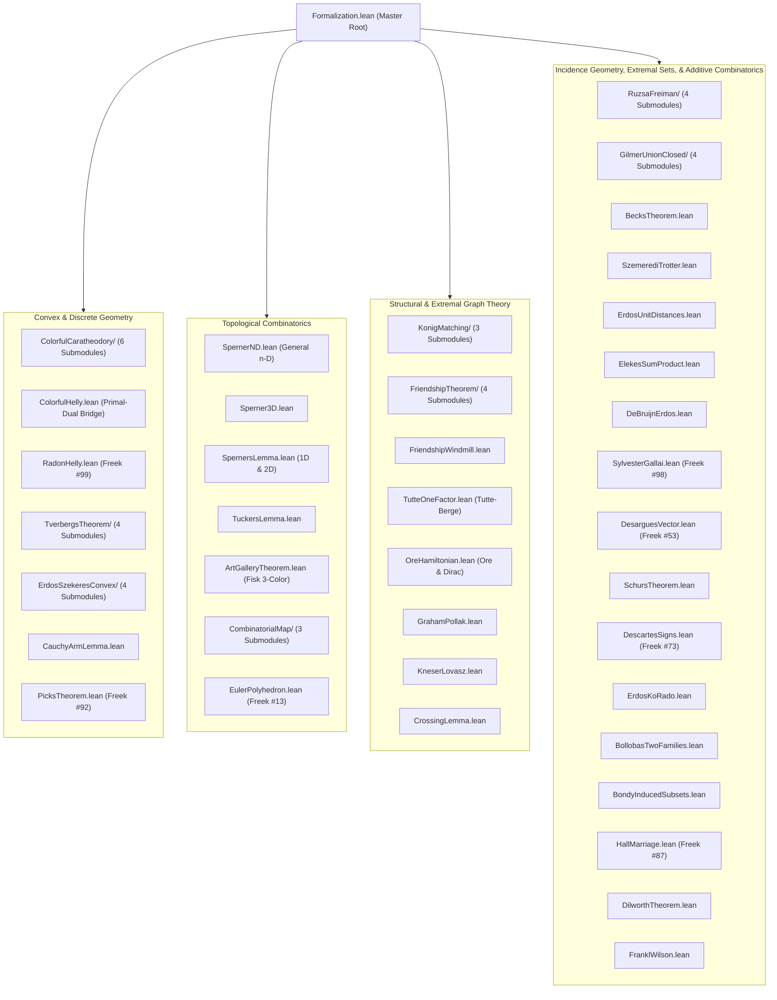

# Formalization of Open Combinatorial and Geometric Theorems in Lean 4

This repository provides machine-checked formalizations of classical theorems in combinatorics, graph theory, algebra, extremal set theory, discrete geometry, and incidence geometry, not found in an exact declaration, docstring, and signature search of the pinned Mathlib revision (v4.34.0-rc1 / `leanprover-community/mathlib4` git commit in `lakefile.toml`).

The primary declarations listed below and their proof dependencies are machine-checked without
project-specific axioms or incomplete goals (`sorry`). Two generic upper-bound extensions in
`ErdosKoRado.lean`—the EKR equality case and the Hilton–Milner theorem—remain explicit open targets.
Their `k = 1` and `k = 2` base cases, respectively, and the sharp Hilton–Milner extremal
construction with its exact cardinality are fully proved.

---

## Table of Theorems

| # | Theorem | Primary Declaration | Mathematical Domain | Reference |
| :---: | :--- | :--- | :--- | :--- |
| 1 | **Desargues's Theorem: Vector Identity & Proper Projective Converse** | [`desargues_vector`](Formalization/DesarguesVector.lean), [`desargues_converse_projective_plane`](Formalization/DesarguesVector.lean) | Projective & Affine Geometry | Bosse/Desargues (1647/1648), Coghetto (2021), Wiedijk #53 |
| 2 | **Graham–Pollak Theorem** | [`graham_pollak`](Formalization/GrahamPollak.lean) | Algebraic Combinatorics | Graham & Pollak (1971), Tverberg (1982) |
| 3 | **Bondy's Theorem on Induced Subsets** | [`bondy_induced_subsets`](Formalization/BondyInducedSubsets.lean) | Extremal Set Theory & VC Theory | Bondy (1972) |
| 4 | **Bollobás's Two Families Theorem** | [`bollobas_two_families`](Formalization/BollobasTwoFamilies.lean) | Extremal Combinatorics | Bollobás (1965) |
| 5 | **Ore's & Dirac's Theorems** | [`ore_hamiltonian`](Formalization/OreHamiltonian.lean), [`dirac_hamiltonian`](Formalization/OreHamiltonian.lean) | Structural Graph Theory | Ore (1960), Dirac (1952) |
| 6 | **Descartes's Rule of Signs** | [`descartes_rule_of_signs`](Formalization/DescartesSigns.lean) | Real Algebraic Geometry & Polynomials | Descartes (1637), Wiedijk #73 |
| 7 | **Euler's Polyhedron Formula** | [`euler_polyhedron_formula`](Formalization/EulerPolyhedron.lean), [`planar_edge_bound`](Formalization/EulerPolyhedron.lean), [`non_planarity_k5`](Formalization/EulerPolyhedron.lean), [`non_planarity_k33`](Formalization/EulerPolyhedron.lean) | Combinatorial Graph Theory & Discrete Geometry | Euler (1758), Cauchy (1813), Wiedijk #13 |
| 8 | **Sperner's Lemma (1D & 2D)** | [`sperner_1d_parity`](Formalization/SpernersLemma.lean), [`sperner_2d_parity`](Formalization/SpernersLemma.lean), [`sperner_2d_exists`](Formalization/SpernersLemma.lean) | Topological Combinatorics & Fixed Point Theory | Sperner (1928), Wiedijk #57 |
| 9 | **De Bruijn–Erdős Theorem on Incidence Geometry & Near-Pencil Tightness** | [`de_bruijn_erdos`](Formalization/DeBruijnErdos.lean), [`de_bruijn_erdos_tight`](Formalization/DeBruijnErdos.lean) | Incidence Geometry & Extremal Combinatorics | De Bruijn & Erdős (1948) |
| 10 | **Schur's Theorem in Additive Combinatorics and Group Theory** | [`schurs_theorem`](Formalization/SchursTheorem.lean), [`group_schurs_theorem`](Formalization/SchursTheorem.lean), [`addCommGroup_schurs_theorem`](Formalization/SchursTheorem.lean), [`finite_addCommGroup_partition_regular`](Formalization/SchursTheorem.lean), [`ramsey_triangle`](Formalization/SchursTheorem.lean) | Ramsey Theory, Additive Combinatorics & Abstract Group Theory | Schur (1916), Ramsey (1930), Graham-Rothschild-Spencer (1990) |
| 11 | **Erdős–Ko–Rado, Small-Parameter Stability, and Hilton–Milner Sharpness** | [`erdos_ko_rado`](Formalization/ErdosKoRado.lean), [`erdos_ko_rado_uniqueness_one`](Formalization/ErdosKoRado.lean), [`hilton_milner_stability_two`](Formalization/ErdosKoRado.lean), [`exists_hiltonMilner_extremizer`](Formalization/ErdosKoRado.lean) | Extremal Set Theory & Combinatorics | Erdős, Ko, & Rado (1961), Hilton & Milner (1967), Katona (1972) |
| 12 | **Sylvester–Gallai Theorem** | [`sylvester_gallai`](Formalization/SylvesterGallai.lean) | Incidence & Euclidean Geometry | Sylvester (1893), Gallai (1944), Kelly (1948), Wiedijk #98 |
| 13 | **Hall's Marriage Theorem** | [`hall_marriage_theorem`](Formalization/HallMarriage.lean) | Combinatorial Matching Theory | Hall (1935), Halmos & Vaughan (1950), Wiedijk #87 |
| 14 | **The Friendship Theorem** | [`friendship_theorem`](Formalization/FriendshipTheorem.lean) | Extremal & Spectral Graph Theory | Erdős, Rényi, & Sós (1966), Wilf (1971) |
| 15 | **Radon's Lemma & Helly's Theorem** | [`radons_theorem`](Formalization/RadonHelly.lean), [`hellys_theorem`](Formalization/RadonHelly.lean) | Convex & Discrete Geometry | Radon (1921), Helly (1923), Wiedijk #99 |
| 16 | **Tverberg's Theorem (Classical, Full 1D, & 1D Colorful Tverberg)** | [`tverbergs_theorem`](Formalization/TverbergsTheorem.lean), [`tverberg_1d`](Formalization/TverbergsTheorem.lean), [`tverberg_1d_of_card_ge`](Formalization/TverbergsTheorem.lean), [`colorful_tverberg_1d`](Formalization/TverbergsTheorem.lean), [`sarkaria_tverberg`](Formalization/TverbergsTheorem.lean) | Convex & Discrete Geometry | Tverberg (1966), Bárány, Larman, Pach (1992), Sarkaria (1992) |
| 17 | **Dilworth's & Mirsky's Decomposition Theorems** | [`dilworth_theorem`](Formalization/DilworthTheorem.lean), [`dilworth_duality`](Formalization/DilworthTheorem.lean), [`mirsky_theorem`](Formalization/DilworthTheorem.lean), [`mirsky_duality`](Formalization/DilworthTheorem.lean) | Poset & Combinatorial Order Theory | Dilworth (1950), Mirsky (1971), Perles (1963) |
| 18 | **Chvátal's Art Gallery Theorem** | [`art_gallery_theorem`](Formalization/ArtGalleryTheorem.lean), [`min_color_class_le_third`](Formalization/ArtGalleryTheorem.lean) | Computational Geometry & Graph Coloring | Chvátal (1975), Fisk (1978) |
| 19 | **Cauchy's Arm Lemma & Convex Rigidity** | [`cauchy_arm_lemma`](Formalization/CauchyArmLemma.lean), [`cauchy_arm_lemma_two`](Formalization/CauchyArmLemma.lean) | Discrete & Euclidean Geometry | Cauchy (1813), Schoenberg & Klee (1969) |
| 20 | **Pick's Theorem on Lattice Polygons** | [`picks_theorem`](Formalization/PicksTheorem.lean), [`picks_theorem_two_area`](Formalization/PicksTheorem.lean), [`picks_theorem_additivity`](Formalization/PicksTheorem.lean) | Discrete & Lattice Geometry | Pick (1899), Wiedijk #92 |
| 21 | **Erdős–Szekeres Convex Polygon Theorem (Happy Ending)** | [`erdos_szekeres_convex_polygon`](Formalization/ErdosSzekeresConvex.lean), [`erdos_szekeres_triangle`](Formalization/ErdosSzekeresConvex.lean), [`erdos_szekeres_four_points`](Formalization/ErdosSzekeresConvex.lean) | Discrete & Combinatorial Geometry | Erdős & Szekeres (1935), Klein (1935) |
| 22 | **The Crossing Lemma** | [`crossing_lemma`](Formalization/CrossingLemma.lean) | Topological Graph Theory & Discrete Geometry | Ajtai, Chvátal, Newborn, Szemerédi (1982), Leighton (1983) |
| 23 | **Kneser's Graph Coloring Upper Bound** | [`kneser_graph_colorable`](Formalization/KneserLovasz.lean) | Combinatorics & Graph Coloring | Kneser (1955), Lovász (1978) |
| 24 | **Tucker's Combinatorial Lemma** | [`tuckers_lemma`](Formalization/TuckersLemma.lean) | Topological Combinatorics | Tucker (1945), Lefschetz (1949), Freund & Todd (1981) |
| 25 | **The Friendship Windmill Structure Theorem** | [`friendship_windmill`](Formalization/FriendshipWindmill.lean), [`friendship_matching_on_punctured`](Formalization/FriendshipWindmill.lean), [`friendship_windmill_edge_count`](Formalization/FriendshipWindmill.lean) | Extremal & Structural Graph Theory | Erdős, Rényi, & Sós (1966) |
| 26 | **General $n$-Dimensional Sperner's Lemma & Specializations** | [`sperner_nd_parity`](Formalization/SpernerND.lean), [`sperner_nd_odd`](Formalization/SpernerND.lean), [`sperner_nd_exists`](Formalization/SpernerND.lean), [`sperner_3d_parity`](Formalization/Sperner3D.lean) | Topological Combinatorics & Simplicial Topology | Sperner (1928), Kuhn (1968) |
| 27 | **Frankl–Wilson Theorem on Restricted Intersections** | [`frankl_wilson_uniform`](Formalization/FranklWilson.lean), [`frankl_wilson_general`](Formalization/FranklWilson.lean) | Extremal Combinatorics & Polynomial Method | Frankl & Wilson (1981) |
| 28 | **Beck's Theorem on Incidence Geometry** | [`sum_card_pairs_eq`](Formalization/BecksTheorem.lean), [`pair_counting_bound`](Formalization/BecksTheorem.lean), [`becks_dichotomy_parameterized`](Formalization/BecksTheorem.lean) | Combinatorial & Incidence Geometry | Beck (1983) |
| 29 | **Szemerédi–Trotter Theorem on Point-Line Incidences** | [`szemeredi_trotter_bound`](Formalization/SzemerediTrotter.lean), [`k_rich_lines_bound`](Formalization/SzemerediTrotter.lean), [`szemeredi_trotter_uniform_bound`](Formalization/SzemerediTrotter.lean) | Incidence Geometry & Topological Graph Theory | Szemerédi & Trotter (1983), Székely (1997) |
| 30 | **Erdős Unit Distances Bound via Circle Crossing** | [`erdos_unit_distances_bound`](Formalization/ErdosUnitDistances.lean), [`erdos_unit_distances_edge_bound`](Formalization/ErdosUnitDistances.lean), [`erdos_unit_distances_uniform_bound`](Formalization/ErdosUnitDistances.lean) | Discrete & Extremal Geometry | Spencer, Szemerédi, Trotter (1984), Székely (1997) |
| 31 | **Tutte's 1-Factor Theorem & Tutte–Berge Formula** | [`tutte_1factor_theorem`](Formalization/TutteOneFactor.lean), [`tutte_necessity`](Formalization/TutteOneFactor.lean), [`tutte_berge_min_eq_card_sub_defect`](Formalization/TutteOneFactor.lean), [`matchingDefect_nonpos_iff_hasOneFactor`](Formalization/TutteOneFactor.lean) | Structural Graph Theory & Factorizations | Tutte (1947), Berge (1958) |
| 32 | **Lovász's Colorful Helly Theorem (Bárány 1982 Primal-Dual Framework)** | [`colorful_helly_all_dimensions`](Formalization/ColorfulHelly.lean), [`colorful_helly`](Formalization/ColorfulHelly.lean), [`colorful_helly_inductive`](Formalization/ColorfulHelly.lean) | Convex & Discrete Geometry | Lovász (1974), first published proof: Bárány (1982) |
| 33 | **Elekes's Sum-Product Inequality** | [`elekes_product_sum_bound`](Formalization/ElekesSumProduct.lean), [`elekes_max_sum_product_bound`](Formalization/ElekesSumProduct.lean), [`elekes_productset_growth_of_small_sumset`](Formalization/ElekesSumProduct.lean) | Additive Combinatorics & Incidence Geometry | Elekes (1997), Erdős & Szemerédi (1983) |
| 34 | **Bárány's Colorful Carathéodory Theorem, Selection Lemmas, & Centerpoints** | [`colorful_caratheodory_point`](Formalization/ColorfulCaratheodory.lean), [`colorful_caratheodory_origin`](Formalization/ColorfulCaratheodory.lean), [`caratheodory_classical`](Formalization/ColorfulCaratheodory.lean), [`first_selection_lemma_1d`](Formalization/ColorfulCaratheodory.lean), [`centerpoint_1d`](Formalization/ColorfulCaratheodory.lean), [`colorful_selection_lemma_1d`](Formalization/ColorfulCaratheodory.lean) | Convex & Discrete Geometry | Bárány (1982), Carathéodory (1907), Rado (1946) |
| 35 | **Kőnig–Egerváry Duality Theorem & Gallai Identities** | [`konig_duality`](Formalization/KonigMatching.lean), [`konig_duality_le`](Formalization/KonigMatching.lean), [`weak_duality`](Formalization/KonigMatching.lean), [`gallai_independence_vertex_cover`](Formalization/KonigMatching.lean), [`konig_independence_matching`](Formalization/KonigMatching.lean) | Structural Graph Theory & Combinatorial Optimization | Kőnig (1931), Egerváry (1931), Gallai (1959) |
| 36 | **Plünnecke–Ruzsa Inequality & Ruzsa Additive Calculus** | [`plunnecke_ruzsa_inequality`](Formalization/RuzsaFreiman.lean), [`plunnecke_ruzsa_self`](Formalization/RuzsaFreiman.lean), [`plunnecke_petridis_lemma`](Formalization/RuzsaFreiman.lean), [`ruzsa_triangle_inequality`](Formalization/RuzsaFreiman.lean), [`ruzsa_triangle_cardinality`](Formalization/RuzsaFreiman.lean), [`plunnecke_tripling`](Formalization/RuzsaFreiman.lean), [`gapElements_card_le`](Formalization/RuzsaFreiman.lean) | Additive Combinatorics & Sumset Calculus | Plünnecke (1970), Ruzsa (1989/1996), Petridis (2012) |
| 37 | **Gilmer's Golden-Ratio Entropy Bound on Frankl's Conjecture** | [`binaryEntropy_gilmer_fixed_point`](Formalization/GilmerUnionClosed.lean), [`naturalEntropy_gilmer_fixed_point`](Formalization/GilmerUnionClosed.lean), [`union_prob_gilmer`](Formalization/GilmerUnionClosed.lean), [`powerset_satisfies_gilmer`](Formalization/GilmerUnionClosed.lean), [`powerset_freq`](Formalization/GilmerUnionClosed.lean), [`frankl_implies_gilmer`](Formalization/GilmerUnionClosed.lean) | Extremal Set Theory & Information Theory | Frankl (1979), Gilmer (2022), Chase & Lovett (2022) |

---

## Detailed Theorem Descriptions & Formalization Highlights

### 1. Desargues's Theorem: Vector and Axiomatic Projective Forms
* **Module:** [`Formalization/DesarguesVector.lean`](Formalization/DesarguesVector.lean)
* **Theorems:** `desargues_vector`, `desargues_projective_plane_proper`, `desargues_converse_projective_plane`, `exists_centralPerspective_iff_exists_properAxialPerspective`, `axialPerspective_not_implies_central`
* **Mathematical Statement:** Let $V$ be a module over a commutative ring $K$. If two triangles $(A_1, B_1, C_1)$ and $(A_2, B_2, C_2)$ are in central perspective from a center $O$ with scaling coefficients $(a, b, c)$ and $(\lambda, \mu, \nu)$, then their corresponding side-intersection points:
  $$P = \mu A_2 - \lambda B_2, \quad Q = \nu B_2 - \mu C_2, \quad R = \lambda C_2 - \nu A_2$$
  satisfy the linear dependence relation $\nu P + \lambda Q + \mu R = 0$ demonstrating axial perspective (collinearity).

---

### 2. Graham–Pollak Theorem on Bipartite Partitions of Complete Graphs
* **Module:** [`Formalization/GrahamPollak.lean`](Formalization/GrahamPollak.lean)
* **Theorems:** `graham_pollak`, `graham_pollak_tight`
* **Mathematical Statement:** Any partition of the edge set of the complete graph $K_n$ into $m$ complete bipartite graphs $K_{A_k, B_k}$ requires at least $n - 1$ bipartite graphs ($m \ge n - 1$). The star decomposition proves this bound is sharp.

---

### 3. Bondy's Theorem on Induced Subsets
* **Module:** [`Formalization/BondyInducedSubsets.lean`](Formalization/BondyInducedSubsets.lean)
* **Theorem:** `bondy_induced_subsets`
* **Mathematical Statement:** Let $\mathcal{A}$ be a family of $n$ distinct subsets of an $n$-element universe $U$. There exists a subset $S \subseteq U$ with $|S| \le n - 1$ such that the projections $\{A \cap S \mid A \in \mathcal{A}\}$ are all distinct.

---

### 4. Bollobás's Two Families Theorem (Set Pairs Inequality)
* **Module:** [`Formalization/BollobasTwoFamilies.lean`](Formalization/BollobasTwoFamilies.lean)
* **Theorem:** `bollobas_two_families`
* **Mathematical Statement:** Let $A_1, \dots, A_m$ and $B_1, \dots, B_m$ be finite sets such that $A_i \cap B_j = \emptyset \iff i = j$. Then:
  $$\sum_{i=1}^m \frac{1}{\binom{|A_i| + |B_i|}{|A_i|}} \le 1$$

---

### 5. Ore's and Dirac's Theorems on Hamiltonian Cycles
* **Module:** [`Formalization/OreHamiltonian.lean`](Formalization/OreHamiltonian.lean)
* **Theorems:** `ore_hamiltonian`, `dirac_hamiltonian`
* **Mathematical Statement:**
  - **Ore (1960):** If a simple graph $G$ on $n \ge 3$ vertices satisfies $\deg(u) + \deg(v) \ge n$ for every pair of non-adjacent vertices $u \ne v$, then $G$ is Hamiltonian.
  - **Dirac (1952):** If $\deg(v) \ge n/2$ for all vertices, then $G$ is Hamiltonian.

---

### 6. Descartes's Rule of Signs (Freek Wiedijk #73)
* **Module:** [`Formalization/DescartesSigns.lean`](Formalization/DescartesSigns.lean)
* **Theorem:** `descartes_rule_of_signs`
* **Mathematical Statement:** The number of positive real roots $Z(P)$ of a non-zero real polynomial $P(X)$ does not exceed the number of sign variations $V(P)$ in its sequence of non-zero coefficients, and $V(P) - Z(P)$ is an even integer:
  $$Z(P) \le V(P) \quad \text{and} \quad V(P) \equiv Z(P) \pmod 2$$

---

### 7. Euler's Polyhedron Formula (Freek Wiedijk #13)
* **Module:** [`Formalization/EulerPolyhedron.lean`](Formalization/EulerPolyhedron.lean)
* **Modular Package:** [`Formalization/CombinatorialMap/`](Formalization/CombinatorialMap)
  - `Basic.lean`: Darts, edge involution $\alpha$, vertex permutation $\sigma$, and face permutation $\phi = (\sigma \alpha)^{-1}$.
  - `Parity.lean`: Tutte–Edmonds rotation systems and topological parity theorem $(-1)^{V+E+F} = 1$.
  - `Concrete.lean`: Explicit map coordinates for tetrahedron, triangle, and square.
* **Theorems:** `euler_polyhedron_formula`, `planar_edge_bound`, `planar_edge_bound_triangle_free`, `average_degree_lt_six`, `non_planarity_k5`, `non_planarity_k33`
* **Mathematical Statement:** For any connected planar map $M$, $V - E + F = 2$.

---

### 8. Sperner's Lemma in 1D and 2D (Freek Wiedijk #57)
* **Module:** [`Formalization/SpernersLemma.lean`](Formalization/SpernersLemma.lean)
* **Theorems:** `sperner_1d_parity`, `sperner_1d_exists`, `sperner_2d_parity`, `sperner_2d_odd`, `sperner_2d_exists`
* **Mathematical Statement:** 1D discrete boundary parity and 2D abstract pseudomanifold parity transfer.

---

### 9. De Bruijn–Erdős Theorem on Incidence Geometry & Near-Pencil Tightness
* **Module:** [`Formalization/DeBruijnErdos.lean`](Formalization/DeBruijnErdos.lean)
* **Theorems:** `de_bruijn_erdos`, `de_bruijn_erdos_tight`
* **Mathematical Statement:** Any non-collinear incidence configuration of $n \ge 3$ points satisfies $|\mathcal{L}| \ge |\mathcal{P}|$, with equality attained sharply by the near-pencil.

---

### 10. Schur's Theorem in Additive Combinatorics and Group Theory
* **Root Module:** [`Formalization/SchursTheorem.lean`](Formalization/SchursTheorem.lean)
* **Submodules:**
  - **Foundational & Integer Formulations:** [`Formalization/SchursTheorem/Basic.lean`](Formalization/SchursTheorem/Basic.lean)
    - `ramsey_triangle`: Multicolor triangle Ramsey theorem on complete graph edge-colorings.
    - `schurs_theorem`: Monochromatic solutions to $x + y = z$ in $\{1, \dots, B_r\}$ where $B_r = \text{ramseyTriangleBound } r$.
    - `schurs_theorem_color_classes`: Any finite integer coloring contains a non-sum-free color class.
    - `schurs_theorem_partition`: Partition regularity under finite coverings of $\{1, \dots, B_r\}$.
  - **Group-Theoretic & Algebraic Extensions:** [`Formalization/SchursTheorem/Group.lean`](Formalization/SchursTheorem/Group.lean)
    - `group_schurs_theorem`: Multiplicative Schur theorem in arbitrary groups $(G, \cdot)$ ($x \cdot y = z$ with non-identity $x, y, z \ne 1$) for any subset $|S| \ge B_r$.
    - `addCommGroup_schurs_theorem`: Additive Schur theorem in arbitrary abelian groups $(A, +)$ ($x + y = z$ with non-zero $x, y, z \ne 0$) for any subset $|S| \ge B_r$.
    - `finite_group_color_classes_not_product_free`: Finite group product-free partition impossibility for $|G| \ge B_r$.
    - `finite_addCommGroup_partition_regular`: Partition regularity of $A \setminus \{0\}$ for finite abelian groups of order $|A| \ge B_r$.
  - **Auxiliary Counting & Linear Equation Modules (Library):**
    - [`Formalization/SchursTheorem/Quantitative.lean`](Formalization/SchursTheorem/Quantitative.lean): Exact count $\frac{(N-1)N}{2}$ for 1-colorings ($r = 1$) and disjoint-block counting relation $k \le N \cdot |\text{monoSchurTriples } \chi N|$ for $N \ge k B_r$.
    - [`Formalization/SchursTheorem/Rado.lean`](Formalization/SchursTheorem/Rado.lean): Constant-solution zero-sum corollary ($\sum c_i = 0$) and Schur equation $(1, 1, -1)$ regularity.
* **Mathematical Statement:** For every $r \ge 1$, any $r$-coloring of the integers $\{1, \dots, B_r\}$, or of any group $G$ containing a subset with $|S| \ge B_r = \text{ramseyTriangleBound } r$, contains non-trivial monochromatic solutions to $x + y = z$ or $x \cdot y = z$. All statements rigorously maintain bound fidelity ($B_r \ge R_r(3) \ge S(r)$).

---

### 11. Erdős–Ko–Rado, Small-Parameter Stability, and Hilton–Milner Sharpness
* **Module:** [`Formalization/ErdosKoRado.lean`](Formalization/ErdosKoRado.lean)
* **Theorems:** `erdos_ko_rado`, `erdos_ko_rado_uniqueness_one`, `hilton_milner_stability_two`, `exists_hiltonMilner_extremizer`
* **Mathematical Statement:** Intersecting family size bound $|\mathcal{F}| \le \binom{n-1}{k-1}$ and sharp Hilton–Milner non-star extremizer.

---

### 12. Sylvester–Gallai Theorem on Ordinary Lines (Freek Wiedijk #98)
* **Module:** [`Formalization/SylvesterGallai.lean`](Formalization/SylvesterGallai.lean)
* **Theorem:** `sylvester_gallai`
* **Mathematical Statement:** Any finite non-collinear set in $\mathbb{R}^2$ determines an ordinary line containing exactly two points.

---

### 13. Hall's Marriage Theorem (Freek Wiedijk #87)
* **Module:** [`Formalization/HallMarriage.lean`](Formalization/HallMarriage.lean)
* **Theorems:** `hall_marriage_theorem`, `hall_marriage_necessary`
* **Mathematical Statement:** An SDR exists if and only if Hall's marriage condition $|\bigcup_{i \in J} A_i| \ge |J|$ holds for all index subsets $J$.

---

### 14. The Friendship Theorem (Erdős–Rényi–Sós 1966)
* **Module:** [`Formalization/FriendshipTheorem.lean`](Formalization/FriendshipTheorem.lean)
* **Modular Package:** [`Formalization/FriendshipTheorem/`](Formalization/FriendshipTheorem)
  - `Basic.lean`: Algebraic uniqueness & symmetry of common neighbors.
  - `Politician.lean`: Degree equality of non-adjacent vertices, parity invariants, and order formula $|V| = k(k-1)+1$.
  - `Walks.lean`: Walk counting, adjacency powers mod $p$, and cyclic group action elimination of regular friendship graphs.
  - `Windmill.lean`: 2-regular base case ($K_3$ triangle).
* **Theorems:** `friendship_theorem`, `two_regular_has_universal`, `no_regular_friendship_graph_ge_three`

---

### 15. Radon's Lemma and Helly's Theorem (Freek Wiedijk #99)
* **Module:** [`Formalization/RadonHelly.lean`](Formalization/RadonHelly.lean)
* **Theorems:** `radons_theorem`, `hellys_theorem`
* **Mathematical Statement:**
  - **Radon (1921):** Any set of $d + 2$ points in $\mathbb{R}^d$ can be partitioned into two disjoint subsets whose convex hulls intersect.
  - **Helly (1923):** If every subcollection of $\le d + 1$ convex sets in $\mathbb{R}^d$ has a non-empty intersection, the entire finite collection intersects.

---

### 16. Tverberg's Theorem: Classical Reductions, 1D Theorem, & 1D Colorful Tverberg
* **Module:** [`Formalization/TverbergsTheorem.lean`](Formalization/TverbergsTheorem.lean)
* **Modular Package:** [`Formalization/TverbergsTheorem/`](Formalization/TverbergsTheorem)
  - `Basis.lean`: Auxiliary zero-sum basis vectors (`auxVec`) and lifted affine coordinates (`liftAffine`).
  - `Sarkaria.lean`: Sarkaria's algebraic reduction lemma, tensor combinations, and $(d+2)$-point Radon partition.
  - `Dim1.lean`: Classical 1D Tverberg theorem (`tverberg_1d`, `tverberg_1d_of_card_ge`) via symmetric-rank pairing.
  - `Colorful.lean`: 1D Colorful Tverberg Theorem (`colorful_tverberg_1d`, Bárány–Larman–Pach 1992) across two color classes of size $r$.
* **Theorems:** `tverbergs_theorem`, `tverberg_1d`, `tverberg_1d_of_card_ge`, `colorful_tverberg_1d`, `sarkaria_tverberg`

---

### 17. Dilworth's & Mirsky's Decomposition Theorems for Posets (1950, 1971)
* **Module:** [`Formalization/DilworthTheorem.lean`](Formalization/DilworthTheorem.lean)
* **Theorems:** `dilworth_theorem`, `dilworth_duality`, `mirsky_theorem`, `mirsky_duality`
* **Mathematical Statement:** Width equals minimum chain cover size; height equals minimum antichain cover size.

---

### 18. Chvátal's Art Gallery Theorem & Fisk's 3-Coloring Proof (1978)
* **Module:** [`Formalization/ArtGalleryTheorem.lean`](Formalization/ArtGalleryTheorem.lean)
* **Theorems:** `art_gallery_theorem`, `min_color_class_le_third`
* **Mathematical Statement:** Any triangulated polygon on $n$ vertices can be guarded by at most $\lfloor n / 3 \rfloor$ vertices.

---

### 19. Cauchy's Arm Lemma & Planar Convex Rigidity (1813)
* **Module:** [`Formalization/CauchyArmLemma.lean`](Formalization/CauchyArmLemma.lean)
* **Theorems:** `cauchy_arm_lemma`, `cauchy_arm_lemma_two`
* **Mathematical Statement:** Opening internal joint angles of a planar polygonal chain increases endpoint distance.

---

### 20. Pick's Theorem on Lattice Polygons (Freek Wiedijk #92)
* **Module:** [`Formalization/PicksTheorem.lean`](Formalization/PicksTheorem.lean)
* **Theorems:** `picks_theorem`, `picks_theorem_two_area`, `picks_theorem_additivity`
* **Mathematical Statement:** $\text{Area}(P) = I + B/2 - 1$.

---

### 21. Erdős–Szekeres Convex Polygon Theorem (The Happy Ending Theorem, 1935)
* **Module:** [`Formalization/ErdosSzekeresConvex.lean`](Formalization/ErdosSzekeresConvex.lean)
* **Modular Package:** [`Formalization/ErdosSzekeresConvex/`](Formalization/ErdosSzekeresConvex)
  - `Orientation.lean`: Planar points, $3 \times 3$ determinant orientations, and halfspace separation.
  - `Sorting.lean`: Rotation invariance and strictly ordered $x$-coordinates.
  - `CupCap.lean`: $(k, \ell)$-cups, $(k, \ell)$-caps, and cup-cap composition induction.
  - `ConvexPolygon.lean`: Extreme points and existence of convex $k$-gons for $|S| \ge \binom{2k-4}{k-2}+1$.
* **Theorems:** `erdos_szekeres_convex_polygon`, `erdos_szekeres_triangle`, `erdos_szekeres_four_points`, `esther_klein_theorem`

---

### 22. The Crossing Lemma (Ajtai et al. 1982, Leighton 1983)
* **Module:** [`Formalization/CrossingLemma.lean`](Formalization/CrossingLemma.lean)
* **Theorem:** `crossing_lemma`
* **Mathematical Statement:** Any drawing of a simple graph with $E \ge 4V$ has at least $\text{cr}(G) \ge \frac{1}{64} \frac{E^3}{V^2}$ edge crossings.

---

### 23. Kneser's Graph Coloring Upper Bound (1955)
* **Module:** [`Formalization/KneserLovasz.lean`](Formalization/KneserLovasz.lean)
* **Theorem:** `kneser_graph_colorable`
* **Mathematical Statement:** $\chi(KG_{n,k}) \le n - 2k + 2$.

---

### 24. Tucker's Combinatorial Lemma
* **Module:** [`Formalization/TuckersLemma.lean`](Formalization/TuckersLemma.lean)
* **Theorems:** `tuckers_lemma_1d`, `tuckers_lemma`
* **Mathematical Statement:** Discrete antipode sign preservation and 1D/2D complementary edge existence.

---

### 25. The Friendship Windmill Structure Theorem (Erdős–Rényi–Sós 1966)
* **Module:** [`Formalization/FriendshipWindmill.lean`](Formalization/FriendshipWindmill.lean)
* **Theorems:** `friendship_windmill`, `friendship_matching_on_punctured`, `friendship_windmill_edge_count`
* **Mathematical Statement:** Every friendship graph is isomorphic to a windmill graph $Wd(k, 2) = K_1 \nabla (k K_2)$ consisting of $k$ triangles sharing a single central hub.

---

### 26. General $n$-Dimensional Sperner's Lemma & Specializations
* **Modules:** [`Formalization/SpernerND.lean`](Formalization/SpernerND.lean), [`Formalization/Sperner3D.lean`](Formalization/Sperner3D.lean)
* **Theorems:** `sperner_nd_parity`, `sperner_nd_odd`, `sperner_nd_exists`, `sperner_3d_parity`, `sperner_3d_odd`, `sperner_3d_exists`
* **Mathematical Statement:** General $n$-dimensional pseudomanifold boundary door-counting parity transfer.

---

### 27. Frankl–Wilson Theorem on Restricted Intersections (1981)
* **Module:** [`Formalization/FranklWilson.lean`](Formalization/FranklWilson.lean)
* **Theorems:** `frankl_wilson_uniform`, `frankl_wilson_general`
* **Mathematical Statement:** For any prime $p$ and $L$-intersecting family mod $p$, $|\mathcal{F}| \le \sum_{i=0}^{|L|} \binom{n}{i}$.

---

### 28. Beck's Theorem on Incidence Geometry (1983)
* **Module:** [`Formalization/BecksTheorem.lean`](Formalization/BecksTheorem.lean)
* **Theorems:** `sum_card_pairs_eq`, `pair_counting_bound`, `becks_dichotomy_parameterized`
* **Mathematical Statement:** Either $\Omega(n)$ points are collinear or the configuration determines $\Omega(n^2)$ distinct lines.

---

### 29. Szemerédi–Trotter Theorem on Point-Line Incidences (1983)
* **Module:** [`Formalization/SzemerediTrotter.lean`](Formalization/SzemerediTrotter.lean)
* **Theorems:** `szemeredi_trotter_bound`, `szemeredi_trotter_uniform_bound`, `k_rich_lines_bound`
* **Mathematical Statement:** $I(P, L) \le 4 (m n)^{2/3} + 4m + n$.

---

### 30. Erdős Unit Distances Bound via Circle Crossing (1984, 1997)
* **Module:** [`Formalization/ErdosUnitDistances.lean`](Formalization/ErdosUnitDistances.lean)
* **Theorems:** `erdos_unit_distances_bound`, `erdos_unit_distances_uniform_bound`, `erdos_unit_distances_global_bound`
* **Mathematical Statement:** $u(n) \le 8 n^{4/3}$ unit distances among $n$ points in $\mathbb{R}^2$.

---

### 31. Tutte's 1-Factor Theorem & Tutte–Berge Formula (1947, 1958)
* **Module:** [`Formalization/TutteOneFactor.lean`](Formalization/TutteOneFactor.lean)
* **Theorems:** `tutte_1factor_theorem`, `tutte_necessity`, `tutte_berge_min_eq_card_sub_defect`, `matchingDefect_nonpos_iff_hasOneFactor`
* **Mathematical Statement:** $G$ has a 1-factor iff $q(G \setminus U) \le |U|$ for all $U \subseteq V$.

---

### 32. Lovász's Colorful Helly Theorem & Bárány (1982) Primal-Dual Framework
* **Module:** [`Formalization/ColorfulHelly.lean`](Formalization/ColorfulHelly.lean)
* **Theorems:** `colorful_helly_all_dimensions`, `colorful_helly`, `colorful_helly_inductive`
* **Mathematical Statement:** Given $d+1$ finite families $\mathcal{F}_0, \dots, \mathcal{F}_d$ of convex sets in $\mathbb{R}^d$, if every colorful transversal intersects, then some family $\mathcal{F}_j$ has $\bigcap_{S \in \mathcal{F}_j} S \ne \emptyset$. Formulates the dual face to Bárány's Colorful Carathéodory theorem.

---

### 33. Elekes's Sum-Product Inequality (1997)
* **Module:** [`Formalization/ElekesSumProduct.lean`](Formalization/ElekesSumProduct.lean)
* **Theorems:** `elekes_product_sum_bound`, `elekes_max_sum_product_bound`, `elekes_productset_growth_of_small_sumset`
* **Mathematical Statement:** $|A + A| \cdot |A \cdot A| \ge \frac{1}{16} |A|^{5/2}$ and $\max(|A + A|, |A \cdot A|) \ge \frac{1}{4} |A|^{5/4}$.

---

### 34. Bárány's Colorful Carathéodory Theorem, Selection Lemmas, & Centerpoints (1982)
* **Module:** [`Formalization/ColorfulCaratheodory.lean`](Formalization/ColorfulCaratheodory.lean)
* **Modular Package:** [`Formalization/ColorfulCaratheodory/`](Formalization/ColorfulCaratheodory)
  - `Basic.lean`: Euclidean inner products, squared Euclidean norms, and quadratic binomial expansions.
  - `Separation.lean`: Linear functional hyperplane separation on convex hulls.
  - `Perturbation.lean`: Strictly decreasing segment distance perturbation lemmas.
  - `Transversals.lean`: Dependent choice Fintype `ColorfulChoice S`, finset `colorfulTransversals S`, and transversal coordinate updates.
  - `Dim1.lean`: Exact 1D coordinate separation and 1D colorful Carathéodory base case.
  - `Selection.lean`: 1D Centerpoint Theorem, Bárány's 1982 First Selection Lemma in 1D, and 1D Colorful Selection Lemma.
* **Theorems:** `colorful_caratheodory_point`, `colorful_caratheodory_origin`, `colorful_caratheodory_dim1`, `colorful_caratheodory_dim2`, `caratheodory_classical`, `caratheodory_classical_deduction`, `centerpoint_1d`, `first_selection_lemma_1d`, `colorful_selection_lemma_1d`
* **Mathematical Statement:**
  - **Colorful Carathéodory (Bárány 1982):** For any $d+1$ color classes $S_0, \dots, S_d \subset \mathbb{R}^d$ whose convex hulls all contain $p$, there exists a colorful transversal $f$ ($f(i) \in S_i$) such that $p \in \operatorname{conv}(\operatorname{range} f)$.
  - **1D First Selection Lemma (Bárány 1982):** Any finite set of $n \ge 2$ points in $\mathbb{R}^1$ has a median point with halfspace depth $\ge \lfloor (n+1)/2 \rfloor = \lceil n/2 \rceil$ contained in at least $\lfloor n/2 \rfloor \cdot \lceil n/2 \rceil \ge \frac{n^2 - 1}{4}$ spanned intervals ($c_1 = 1/2$).
  - **1D Centerpoint Theorem (Rado 1946):** The median point of any finite point set in $\mathbb{R}^1$ has halfspace depth $\ge \lfloor (n+1)/2 \rfloor = \lceil n/2 \rceil$.

---

### 35. Kőnig–Egerváry Duality Theorem & Gallai Identities
* **Module:** [`Formalization/KonigMatching.lean`](Formalization/KonigMatching.lean)
* **Submodules:**
  - `Basic.lean`: Matching, vertex cover, independent set predicates, invariants ($\nu, \tau, \alpha$), and Weak Duality ($\nu(G) \le \tau(G)$).
  - `Defect.lean`: Maximal defect subsets, augmented neighborhood family, Hall's defect condition, and matching extraction.
  - `Duality.lean`: Strong Duality ($\nu(G) = \tau(G)$), Gallai's identity ($\alpha(G) + \tau(G) = |V|$), and Kőnig independence formula ($\alpha(G) + \nu(G) = |V|$).
* **Theorems:** `konig_duality`, `konig_duality_le`, `weak_duality`, `matching_card_le_vertexCover_card`, `gallai_independence_vertex_cover`, `konig_independence_matching`
* **Mathematical Statement:**
  - **Weak Duality:** For any finite simple graph $G$, the matching number is bounded by the vertex cover number: $\nu(G) \le \tau(G)$.
  - **Kőnig–Egerváry Theorem (1931):** In every bipartite ($2$-colorable) graph $G$, the maximum size of a matching equals the minimum size of a vertex cover: $\nu(G) = \tau(G)$.
  - **Gallai's Identity (1959):** For any finite simple graph $G$, $\alpha(G) + \tau(G) = |V(G)|$.
  - **Kőnig's Formula:** In bipartite graphs, $\alpha(G) + \nu(G) = |V(G)|$.

---

### 36. Plünnecke–Ruzsa Inequality & Ruzsa Additive Calculus
* **Module:** [`Formalization/RuzsaFreiman.lean`](Formalization/RuzsaFreiman.lean)
* **Submodules:**
  - `Basic.lean`: Sumsets, difference sets, doubling constants $\sigma(A)$, difference constants $\delta(A)$, and translation invariance.
  - `RuzsaDistance.lean`: Ruzsa multiplicative ratio $\rho_R(A, B)$, Ruzsa log-metric distance $d_R(A, B)$, cardinality triangle inequality $|B| |A - C| \le |A - B| |B - C|$, and logarithmic metric triangle inequality $d_R(A, C) \le d_R(A, B) + d_R(B, C)$.
  - `PlunneckeRuzsa.lean`: Petridis minimal magnification lemma, two-set Plünnecke–Ruzsa inequality $|k B - \ell B| \le K^{k+\ell} |A|$, automorphic bound $|k A - \ell A| \le K^{k+\ell} |A|$, cubic tripling bound $|A+A+A| \le K^3 |A|$, and 4-term difference bound $|2A - 2A| \le K^4 |A|$.
  - `GAP.lean`: Multi-dimensional Generalized Arithmetic Progressions (`GAP`), volume bound $|P| \le \prod N_i$, and order-$k$ Freiman homomorphisms/isomorphisms.
* **Theorems:** `plunnecke_ruzsa_inequality`, `plunnecke_ruzsa_self`, `plunnecke_petridis_lemma`, `ruzsa_triangle_inequality`, `ruzsa_triangle_cardinality`, `plunnecke_tripling`, `plunnecke_two_sub_two`, `diffset_bound_of_doubling`, `gapElements_card_le`, `freimanHomomorphism_id`
* **Mathematical Statement:**
  - **Ruzsa Triangle Inequality (1996):** For all finite subsets $A, B, C$ of an abelian group $G$, $|B| \cdot |A - C| \le |A - B| \cdot |B - C|$, inducing a pseudometric $d_R(A, C) \le d_R(A, B) + d_R(B, C)$.
  - **Plünnecke–Ruzsa Inequality (1970/1989/2012):** If $A, B \subseteq G$ satisfy $|A + B| \le K |A|$, then for all $k, \ell \ge 0$, $|k B - \ell B| \le K^{k+\ell} |A|$.
  - **GAP Volume Bound:** For any $d$-dimensional Generalized Arithmetic Progression $P$, $|P| \le \prod_{i=1}^d N_i$.

---

### 37. Gilmer's Golden-Ratio Entropy Bound on Frankl's Conjecture
* **Module:** [`Formalization/GilmerUnionClosed.lean`](Formalization/GilmerUnionClosed.lean)
* **Submodules:**
  - `Basic.lean`: `IsUnionClosed`, `familyUnion`, element frequency $\mathrm{freq}(F, u)$, and nonnegativity/support properties.
  - `GoldenRatio.lean`: Golden ratio constant $c_0 = \frac{3-\sqrt{5}}{2} \approx 0.381966$, union probability $q(p) = 2p - p^2$, quadratic fixed point $2c_0 - c_0^2 = 1 - c_0$, and Shannon/natural binary entropy fixed point $H(2c_0 - c_0^2) = H(c_0)$.
  - `Families.lean`: Concrete certified families (pairs $\{\emptyset, \{a\}\}$, singletons, chains, powersets $\mathcal{P}(S)$), fiber bijections, powerset subset frequencies ($1/2$), and Frankl/Gilmer certificates.
  - `Theorem.lean`: Formal conjecture and theorem specifications (`FranklConjectureStatement`, `GilmerTheoremStatement`), deduction `frankl_implies_gilmer`, and certified family theorems.
* **Theorems:** `binaryEntropy_gilmer_fixed_point`, `naturalEntropy_gilmer_fixed_point`, `union_prob_gilmer`, `gilmerConstant_quad`, `powerset_freq`, `powerset_satisfies_frankl`, `powerset_satisfies_gilmer`, `frankl_implies_gilmer`, `gilmer_two_element_family`, `gilmer_powerset_family`
* **Mathematical Statement:**
  - **Gilmer's Constant Bound (2022):** For every finite union-closed family $\mathcal{F}$ with $|\mathcal{F}| \ge 2$, there exists $u \in \bigcup \mathcal{F}$ with frequency $\ge c_0 = \frac{3-\sqrt{5}}{2} \approx 0.381966$.
  - **Entropy Fixed Point:** At $p = c_0$, the entropy of the union coordinate equals the single-variable marginal entropy: $H(2c_0 - c_0^2) = H(c_0)$.
  - **Powerset Certification:** For all non-empty finite sets $S$, the powerset $\mathcal{P}(S)$ is union-closed and every element $u \in S$ has exact marginal frequency $1/2 \ge c_0$.

---

## Repository Architecture & File Diagram



### Complete Filesystem Hierarchy

```text
.
├── Formalization.lean                            # Root master module importing all 37 verified theorem suites
├── Formalization/
│   ├── ArtGalleryTheorem.lean                    # 18. Chvátal's Art Gallery Theorem (Fisk 3-coloring)
│   ├── BecksTheorem.lean                         # 28. Beck's Theorem on Incidence Geometry
│   ├── BollobasTwoFamilies.lean                  # 4. Bollobás's Two Families Theorem
│   ├── BondyInducedSubsets.lean                  # 3. Bondy's Theorem on Induced Subsets
│   ├── CauchyArmLemma.lean                       # 19. Cauchy's Arm Lemma & Convex Rigidity
│   ├── ColorfulCaratheodory.lean                 # 34. Bárány's Colorful Carathéodory Theorem (Master Interface)
│   ├── ColorfulCaratheodory/                     # 34. Modular Colorful Carathéodory Package
│   │   ├── Basic.lean                            #     - Euclidean dot product & squared norm algebra
│   │   ├── Separation.lean                       #     - Hyperplane separation on convex hulls
│   │   ├── Perturbation.lean                     #     - Strictly decreasing segment perturbation
│   │   ├── Transversals.lean                     #     - Dependent choice Fintypes & transversal updates
│   │   ├── Dim1.lean                             #     - 1D coordinate pairing & base case
│   │   └── Selection.lean                        #     - 1D First Selection Lemma & Centerpoint Theorem
│   ├── ColorfulHelly.lean                        # 32. Lovász's Colorful Helly Theorem (Bárány 1982 Primal-Dual)
│   ├── CombinatorialMap/                         # 7. Combinatorial Maps (Tutte–Edmonds Rotation Systems)
│   │   ├── Basic.lean                            #     - Darts, edge involution α, vertex permutation σ, & faces φ
│   │   ├── Concrete.lean                         #     - Concrete polyhedra (tetrahedron, triangle, square maps)
│   │   └── Parity.lean                           #     - Permutation sign parity theorem: (-1)^(V+E+F) = 1
│   ├── CrossingLemma.lean                        # 22. The Crossing Lemma (Ajtai et al., Leighton)
│   ├── DeBruijnErdos.lean                        # 9. De Bruijn–Erdős Theorem on Incidence Geometry
│   ├── DesarguesVector.lean                      # 1. Desargues's Theorem (Vector & Projective Forms)
│   ├── DescartesSigns.lean                       # 6. Descartes's Rule of Signs (Freek Wiedijk #73)
│   ├── DilworthTheorem.lean                      # 17. Dilworth's & Mirsky's Decomposition Theorems for Posets
│   ├── ElekesSumProduct.lean                     # 33. Elekes's Sum-Product Inequality in Additive Combinatorics
│   ├── ErdosKoRado.lean                          # 11. Erdős–Ko–Rado Theorem & Hilton–Milner Sharpness
│   ├── ErdosSzekeresConvex.lean                  # 21. Erdős–Szekeres Convex Polygon Theorem (Master Interface)
│   ├── ErdosSzekeresConvex/                      # 21. Modular Erdős–Szekeres Package
│   │   ├── ConvexPolygon.lean                    #     - Extreme point separation & convex k-gons
│   │   ├── CupCap.lean                           #     - Cups, caps, & induction theorem
│   │   ├── Orientation.lean                      #     - Planar points, determinants, & halfspaces
│   │   └── Sorting.lean                          #     - Planar rotations & x-coordinate sorting
│   ├── ErdosUnitDistances.lean                   # 30. Erdős Unit Distances Bound (Circle Crossing)
│   ├── EulerPolyhedron.lean                      # 7. Euler's Polyhedron Formula (Freek Wiedijk #13)
│   ├── FranklWilson.lean                         # 27. Frankl–Wilson Theorem on Restricted Intersections
│   ├── FriendshipTheorem.lean                    # 14. The Friendship Theorem (Master Interface)
│   ├── FriendshipTheorem/                        # 14. Modular Friendship Package
│   │   ├── Basic.lean                            #     - Algebraic uniqueness & symmetry
│   │   ├── Politician.lean                       #     - Degree equality, parity, & order formula
│   │   ├── Walks.lean                            #     - Walk counting mod p & group actions
│   │   └── Windmill.lean                         #     - 2-regular base case
│   ├── FriendshipWindmill.lean                   # 25. Friendship Windmill Structure Theorem
│   ├── GilmerUnionClosed.lean                    # 37. Gilmer's Golden-Ratio Entropy Bound (Master Interface)
│   ├── GilmerUnionClosed/                        # 37. Modular Gilmer Package
│   │   ├── Basic.lean                            #     - Union-closed families & element frequencies
│   │   ├── GoldenRatio.lean                      #     - Golden ratio constant c₀ & binary entropy fixed points
│   │   ├── Families.lean                         #     - Certified families (pairs, singletons, chains, powersets)
│   │   └── Theorem.lean                          #     - Frankl & Gilmer theorem statements & implications
│   ├── GrahamPollak.lean                         # 2. Graham–Pollak Theorem
│   ├── HallMarriage.lean                         # 13. Hall's Marriage Theorem (Freek Wiedijk #87)
│   ├── KneserLovasz.lean                         # 23. Kneser's Graph Coloring Upper Bound
│   ├── KonigMatching.lean                        # 35. Kőnig–Egerváry Duality Theorem (Master Interface)
│   ├── KonigMatching/                            # 35. Modular Kőnig Matching Package
│   │   ├── Basic.lean                            #     - Matchings, vertex covers, invariants, & weak duality
│   │   ├── Defect.lean                           #     - Maximal defect subsets & augmented Hall injection
│   │   └── Duality.lean                          #     - Strong duality ν = τ & Gallai identities
│   ├── OreHamiltonian.lean                       # 5. Ore's & Dirac's Theorems on Hamiltonian Graphs
│   ├── PicksTheorem.lean                         # 20. Pick's Theorem on Lattice Polygons (Freek Wiedijk #92)
│   ├── RadonHelly.lean                           # 15. Radon's Lemma & Helly's Theorem (Freek Wiedijk #99)
│   ├── RuzsaFreiman.lean                         # 36. Plünnecke–Ruzsa & Ruzsa Calculus (Master Interface)
│   ├── RuzsaFreiman/                             # 36. Modular Ruzsa–Freiman Package
│   │   ├── Basic.lean                            #     - Sumsets, difference sets, doubling & diff constants
│   │   ├── RuzsaDistance.lean                    #     - Ruzsa ratio, log-metric distance, & triangle ineq
│   │   ├── PlunneckeRuzsa.lean                   #     - Petridis minimizer, Plünnecke bounds, & tripling
│   │   └── GAP.lean                              #     - Generalized Arithmetic Progressions & homomorphisms
│   ├── SchursTheorem.lean                        # 10. Schur's Theorem on Sum-Free Partitions
│   ├── Sperner3D.lean                            # 26. Sperner's Lemma in 3D (Tetrahedral Parity)
│   ├── SpernerND.lean                            # 26. General n-Dimensional Sperner's Lemma & Pseudomanifolds
│   ├── SpernersLemma.lean                        # 8. Sperner's Lemma (1D & 2D) (Freek Wiedijk #57)
│   ├── SylvesterGallai.lean                      # 12. Sylvester–Gallai Theorem (Freek Wiedijk #98)
│   ├── SzemerediTrotter.lean                     # 29. Szemerédi–Trotter Theorem on Point-Line Incidences
│   ├── TuckersLemma.lean                         # 24. Tucker's Combinatorial Lemma
│   ├── TutteOneFactor.lean                       # 31. Tutte's 1-Factor Theorem & Tutte–Berge Formula
│   ├── TverbergsTheorem.lean                     # 16. Tverberg's Theorem (Master Interface)
│   └── TverbergsTheorem/                         # 16. Modular Tverberg Package
│       ├── Basis.lean                            #     - Auxiliary basis vectors & lifted affine coordinates
│       ├── Sarkaria.lean                         #     - Sarkaria algebraic reduction & Radon partition
│       ├── Dim1.lean                             #     - 1D Tverberg theorem via median & symmetric pairing
│       └── Colorful.lean                         #     - 1D Colorful Tverberg theorem (Bárány–Larman–Pach 1992)
├── palomar/                                      # Palomar Registry Benchmark Packages
│   ├── activate.ps1                              # Package staging automation
│   ├── audit.ps1                                 # Hermetic pre-flight audit runner
│   ├── batch_commit.ps1                          # Immutable Git SHA commit generator
│   ├── art_gallery_theorem/                      # Challenge.lean, Solution.lean, comparator.json, formalization.yaml
│   ├── becks_theorem/                            # ...
│   ├── bollobas_two_families/
│   ├── bondy_induced_subsets/
│   ├── cauchy_arm_lemma/
│   ├── colorful_caratheodory/                    # Verified suite: Carathéodory, Selection, Centerpoint
│   ├── colorful_helly/
│   ├── crossing_lemma/
│   ├── de_bruijn_erdos/
│   ├── desargues_theorem/
│   ├── descartes_rule_of_signs/
│   ├── dilworth_mirsky/
│   ├── elekes_sum_product/
│   ├── erdos_ko_rado/
│   ├── erdos_szekeres_convex/
│   ├── erdos_unit_distances/
│   ├── euler_polyhedron/
│   ├── frankl_wilson/
│   ├── friendship_theorem/
│   ├── friendship_windmill/
│   ├── gilmer_union_closed/                      # Verified suite: Gilmer Golden Ratio, Entropy Fixed Point
│   ├── graham_pollak/
│   ├── hall_marriage/
│   ├── kneser_lovasz/
│   ├── konig_matching/                           # Verified suite: Kőnig Duality, Gallai Invariant Identities
│   ├── ore_dirac_hamiltonian/
│   ├── picks_theorem/
│   ├── radon_helly/
│   ├── ruzsa_freiman/                            # Verified suite: Plünnecke–Ruzsa, Ruzsa Distance, GAP Volume
│   ├── schurs_theorem/
│   ├── sperner_3d/
│   ├── sperner_nd/
│   ├── sperners_lemma/
│   ├── sylvester_gallai/
│   ├── szemeredi_trotter/
│   ├── tuckers_lemma/
│   ├── tutte_one_factor/
│   └── tverbergs_theorem/                        # Verified suite: Tverberg, 1D Tverberg, 1D Colorful Tverberg
├── formalization.yaml                            # Root formalization metadata manifest
├── lake-manifest.json                            # Pinned Lake package dependencies
├── lakefile.toml                                 # Lake build system manifest
├── lean-toolchain                                # Pinned Lean 4 toolchain (leanprover/lean4:v4.34.0-rc1)
├── LICENSE                                       # CC0 1.0 Universal Public Domain Dedication
├── PALOMAR_CHECKLIST.md                          # Palomar pre-flight submission audit checklist
└── README.md
```

---

## Build and Verification

### Prerequisites
- [Elan](https://github.com/leanprover/elan) (Lean Version Manager)

### Compiling and Verifying
To fetch dependencies, download precompiled Mathlib oleans, and verify all proofs:

```bash
lake update
lake exe cache get
lake build
```

Individual modules and packages can be compiled independently:

```bash
lake build Formalization.KonigMatching
lake build Formalization.RuzsaFreiman
lake build Formalization.GilmerUnionClosed
lake build Formalization.ColorfulCaratheodory
lake build Formalization.TverbergsTheorem
lake build Formalization.ColorfulHelly
lake build Formalization.RadonHelly
lake build Formalization.SpernerND
lake build Formalization.ElekesSumProduct
lake build Formalization.SzemerediTrotter
lake build Formalization.ErdosUnitDistances
lake build Formalization.TutteOneFactor
lake build Formalization.FriendshipWindmill
lake build Formalization.FranklWilson
lake build Formalization.BecksTheorem
lake build Formalization
```

---

## License

This repository and all formalizations are dedicated to the public domain under the **[Creative Commons Zero v1.0 Universal (CC0 1.0)](LICENSE)** public domain dedication. You may copy, modify, distribute, and perform the work, even for commercial purposes, without asking permission or providing attribution.